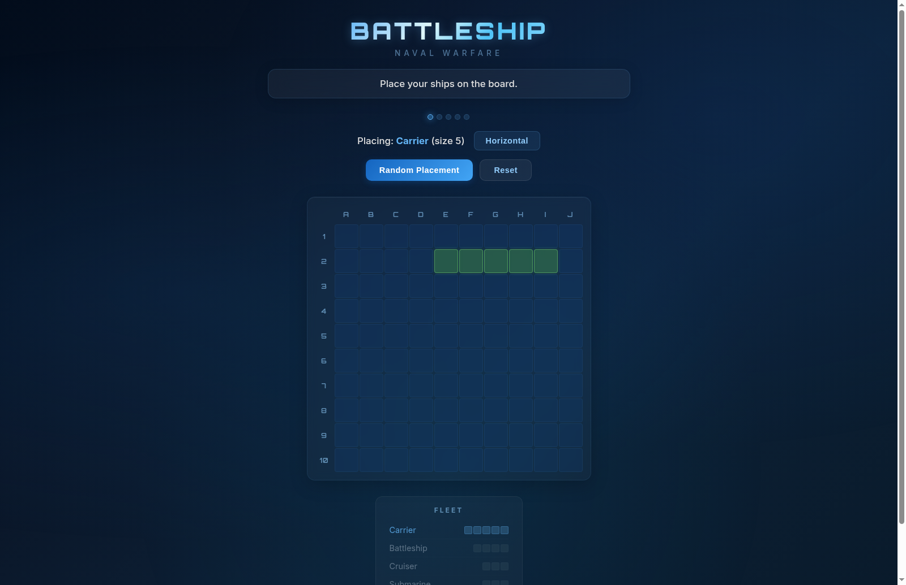
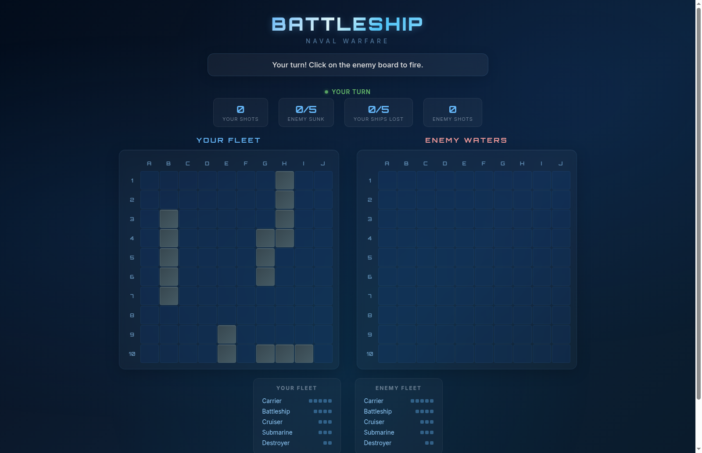

# Battleship: Naval Warfare

A browser-based Battleship game built with React. Place your fleet on a 10x10 grid and battle an AI opponent that uses a hunt/target strategy to find and sink your ships.




## Features

- **Ship Placement** — Place 5 ships manually by clicking the board, toggle orientation, or use Random Placement
- **AI Opponent** — Hunt/target mode AI that detects hit lines, prioritizes extending them, and handles overlapping multi-ship scenarios
- **Real-time Stats** — Shot counts, ships sunk, and fleet status panels for both sides
- **Polished UI** — Glassmorphism boards, Orbitron/Inter fonts, animated turn indicator, context-aware message bar colors, Victory/Defeat overlay
- **Responsive** — Adapts to smaller screens with media queries

## Fleet

| Ship | Size |
|------|------|
| Carrier | 5 |
| Battleship | 4 |
| Cruiser | 3 |
| Submarine | 3 |
| Destroyer | 2 |

## Getting Started

### Prerequisites

- Node.js (v16+)
- npm

### Install and Run

```bash
git clone https://github.com/joeyoo123/battleship-game-windsurf.git
cd battleship-game-windsurf
npm install
npm start
```

The app will open at [http://localhost:3000](http://localhost:3000).

### Run Tests

```bash
npm test
```

33 unit tests covering placement logic, firing mechanics, ship sinking, and AI targeting behavior.

### Build for Production

```bash
npm run build
```

## How to Play

1. **Place your ships** — Click cells on the board to place each ship. Use the orientation toggle to switch between horizontal and vertical. Click "Random Placement" to auto-place remaining ships.
2. **Battle** — Click cells on the Enemy Waters board to fire. Hits show as orange, misses as dots, and sunk ships glow red.
3. **Win** — Sink all 5 enemy ships before the AI sinks yours.

## Tech Stack

- **React 18** — UI framework
- **Create React App** — Build tooling
- **CSS3** — Animations, glassmorphism, gradients
- **Google Fonts** — Orbitron + Inter

## Project Structure

```
src/
├── App.js              # Main game component (state, phases, rendering)
├── App.css             # Global styles, animations, layout
├── index.js            # React entry point
├── index.css           # Base styles, font imports
├── gameLogic.js        # Board operations, firing, AI targeting
├── gameLogic.test.js   # 33 unit tests
└── components/
    ├── Board.js        # 10x10 grid component
    ├── Board.css       # Board styles
    ├── ShipPlacer.js   # Ship placement UI
    └── ShipPlacer.css  # Placement styles
```

## License

MIT
